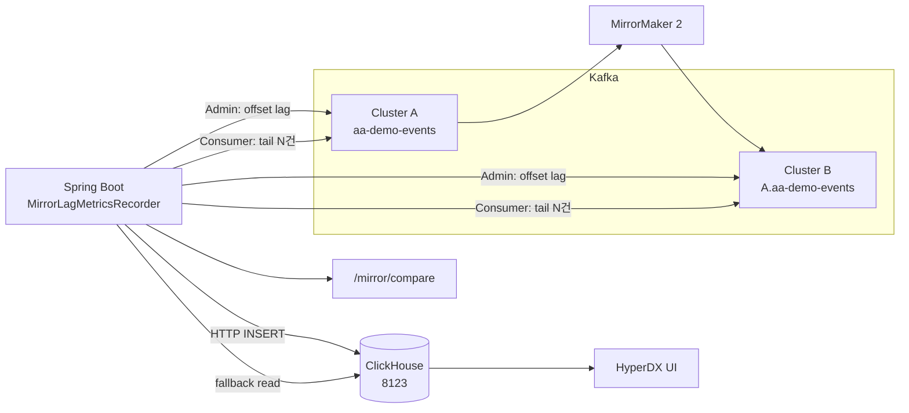

# Kafka MM2 미러 지표를 ClickHouse에 쌓기 — Spring 스크래퍼 설계

Active-Active Kafka + MirrorMaker 2(MM2) 환경에서, **소스 토픽과 미러 토픽(`A.example_topic`)을 같은 화면에서 비교**하고 **복제 지연을 대략적으로 수치화**하기 위해 Spring Boot가 주기적으로 Kafka를 읽어 **ClickHouse HTTP(8123)** 로 적재하는 구조를 정리한 글이다.

HyperDX는 ClickHouse를 데이터 소스로 붙여 검색·차트 UI를 제공한다. (직접 Kafka를 HyperDX가 읽는 구조는 아니다.)

---

## 1. 전체 아키텍처



**한 줄 요약**

1. MM2가 A의 토픽을 B에 `A.{원본토픽명}` 으로 복제한다.
2. Spring이 **15초마다**(기본) lag + tail을 읽는다.
3. 같은 JSON `id`로 소스/미러를 매칭해 지연 컬럼을 계산한다.
4. ClickHouse 3개 테이블에 INSERT 한다.
5. HyperDX / 자체 웹 UI / SQL로 조회한다.

---

## 2. 전제: 토픽 이름과 클러스터

| 구분 | 설정 예 | 의미 |
|------|---------|------|
| 소스 클러스터 | `A` | 원본 메시지가 있는 쪽 |
| 미러 클러스터 | `B` | MM2가 복제해 넣는 쪽 |
| 소스 토픽 | `aa-demo-events` | A에 produce |
| 미러 토픽 | `A.aa-demo-events` | B에 MM2가 만든 토픽 |

`application.yaml` 예시:

```yaml
app:
  mirror-metrics:
    enabled: true
    interval-ms: 15000
    source-cluster: A
    mirror-cluster: B
    source-topic: aa-demo-events
    mirror-topic: A.aa-demo-events
    tail-sample-limit: 24
    tail-to-clickhouse: true
  clickhouse:
    enabled: true
    http-url: http://127.0.0.1:8123
    database: default
    user: default
    password: ""
```

---

## 3. ClickHouse 스키마

DDL: `infra/clickhouse/init.sql`

### 3.1 `mirror_lag` — 파티션 단위 offset lag 스냅샷

MM2가 얼마나 뒤처졌는지 **메시지 개수 근사치**를 주기적으로 남긴다.

| 컬럼 | 설명 |
|------|------|
| `ts` | INSERT 시각 (서버 `now()`) |
| `lag_messages` | 파티션별 `max(0, source_latest - mirror_latest)` 합 |
| `source_hwm` / `mirror_hwm` | 각 토픽 latest offset 합 |
| `source_cluster`, `mirror_cluster` | A, B |
| `source_topic`, `mirror_topic` | 토픽명 |

```sql
CREATE TABLE default.mirror_lag (
    ts DateTime DEFAULT now(),
    lag_messages Int64,
    source_hwm Int64,
    mirror_hwm Int64,
    source_cluster LowCardinality(String),
    mirror_cluster LowCardinality(String),
    source_topic LowCardinality(String),
    mirror_topic LowCardinality(String)
) ENGINE = MergeTree ORDER BY ts;
```

### 3.2 `mirror_message_tail` — 소스/미러 tail 메시지 스냅샷

스크래프 시점에 Kafka에서 읽은 **최근 N건**을 `role=source|mirror` 로 그대로 적재한다. HyperDX에서 “양쪽 메시지 나란히 보기”용.

| 컬럼 | 설명 |
|------|------|
| `ts` | 적재 시각 (`DateTime64(3)`) |
| `lag_at_scrape` | 그때의 `lag_messages` |
| `role` | `source` / `mirror` |
| `cluster`, `topic` | 어느 클러스터·토픽에서 읽었는지 |
| `partition`, `offset` | Kafka 위치 |
| `kafka_ts_ms` | 레코드 LogAppendTime(ms) |
| `value` | 페이로드 문자열 (JSON `id`, `sentAtMs` 포함) |

### 3.3 `mirror_message_compare` — id 매칭 + 지연 지표

JSON 페이로드의 **`id` 필드**로 소스·미러 레코드를 짝 지은 결과. **한 `message_id`당 스크래퍼가 처음 “양쪽 다 봤을 때” 한 번** INSERT 한다.

| 컬럼 | 설명 |
|------|------|
| `message_id` | JSON `id` |
| `replication_delay_ms` | `mirror_seen_at_ms - source_seen_at_ms` |
| `replication_delay_sec` | 위 값 / 1000 |
| `end_to_end_delay_ms` | `mirror_seen_at_ms - sent_at_ms` |
| `kafka_timestamp_delta_ms` | `mirror_kafka_ts_ms - source_kafka_ts_ms` |
| `source_seen_at_ms`, `mirror_seen_at_ms` | 스크래퍼가 각쪽 tail에서 **처음 관측**한 시각 |

> **주의:** `replication_delay_*` 는 MM2 내부 큐 지연이 아니라, **스크래프 주기(기본 15초) 단위의 관측 지연**에 가깝다. scrape interval보다 짧은 복제는 0ms에 가깝게, 길면 한 스크래프 창만큼 튀어 보일 수 있다.

---

## 4. Spring 스크래퍼: `MirrorLagMetricsRecorder`

`@Scheduled(fixedDelayString = "${app.mirror-metrics.interval-ms:15000}")` 로 동작한다.

```text
1. MirrorReplicationLagService.compute()
   → AdminClient listOffsets(LATEST) 로 lag 스냅샷
2. ClickHouseMirrorLagSink.write()  → mirror_lag
3. (tail-to-clickhouse=true 일 때)
   a. TopicRecentTailReader.readTail() × 2 (소스/미러)
   b. ClickHouseMirrorTailSink.write()  → mirror_message_tail
   c. MirrorMessageCompareService.observeAndCompare()
   d. ClickHouseMirrorCompareSink.write()  → mirror_message_compare
4. Micrometer Gauge 갱신 (Prometheus)
```

관련 클래스:

| 클래스 | 역할 |
|--------|------|
| `MirrorReplicationLagService` | offset lag / HWM 계산 |
| `TopicRecentTailReader` | 토픽 tail consumer (파티션별) |
| `MirrorMessageCompareService` | in-memory id 매칭 + 지연 계산 |
| `ClickHouseMirrorLagSink` | lag INSERT |
| `ClickHouseMirrorTailSink` | tail INSERT |
| `ClickHouseMirrorCompareSink` | compare INSERT |

---

## 5. 메시지 페이로드와 id 매칭

Producer(`DualClusterTrafficProducer`)는 메시지를 JSON으로 보낸다.

```json
{
  "id": "demo-1778686527374-uuid",
  "sentAtMs": 1778686527374,
  "prefix": "demo",
  "batchIndex": 0,
  "value": "demo-0"
}
```

`MirrorMessageCompareService`는 tail에서 `value`를 파싱해 `id`를 키로 쓴다.

- `sourceSeen` / `mirrorSeen`: id → (파싱된 메시지, **첫 관측 시각**)
- 소스·미러 **둘 다** 관측된 id만 `mirror_message_compare` 행 생성
- `emitted` Set으로 동일 id 중복 INSERT 방지
- 10분 지난 관측은 메모리에서 eviction

**운영 시 알아둘 점**

- produce가 **A/B 50:50 라운드로빈**이면, 소스 토픽(A)에만 있는 메시지와 B에만 있는 메시지가 섞인다. compare는 **A 소스 토픽 vs B의 `A.aa-demo-events`** 기준이므로, B에만 넣은 메시지는 “소스 없음” 페어가 될 수 있다.
- MM2 복제가 스크래프 한 번 돌기 전에 끝나지 않으면 **소스만** tail/CH에 남고 미러는 비어 보일 수 있다.

---

## 6. ClickHouse INSERT 방식 (HTTP 8123)

Spring은 **JDBC 없이** `RestClient`로 ClickHouse HTTP 인터페이스에 POST 한다.

공통 URL 형태:

```text
POST {http-url}/?database=default&query={INSERT ... FORMAT ...}&user=default&password=
Content-Type: text/plain
Body: {rows}
```

### 6.1 `mirror_lag` — JSONEachRow

한 스크래프당 1행 JSON.

```java
INSERT INTO default.mirror_lag (...) FORMAT JSONEachRow
{"lag_messages":0,"source_hwm":4578,...}
```

### 6.2 `mirror_message_tail` / `mirror_message_compare` — TabSeparated

여러 행을 TSV로 보낸다. 탭·개행은 `tsvEsc()` 로 이스케이프.

```java
INSERT INTO default.mirror_message_tail (...) FORMAT TabSeparated
{lag}\t{role}\t{cluster}\t...
```

실패 시 로그만 남기고 스케줄러는 다음 주기에 재시도한다 (`log.warn`).

---

## 7. HyperDX 연동

`infra/hyperdx/docker-compose.yml` 에서 HyperDX만 띄우고, **호스트 ClickHouse `127.0.0.1:8123`** 에 연결한다. (`network_mode: host`)

기본 데이터 소스:

| HyperDX 소스명 | ClickHouse 테이블 | 용도 |
|----------------|-------------------|------|
| Kafka Mirror Messages | `mirror_message_tail` | 소스/미러 메시지 검색 |
| Kafka Mirror Delay | `mirror_message_compare` | id별 지연(ms/sec) |
| Kafka Mirror Lag | `mirror_lag` | lag/HWM 추이 |

로컬 PC에서 볼 때는 SSH 터널 예:

```bash
ssh -4 -i local-ssh.pem -L 3000:127.0.0.1:3000 -L 8000:127.0.0.1:8000 ubuntu@192.168.160.147
# 브라우저: http://127.0.0.1:3000
```

**시간 범위:** `ts`는 ClickHouse INSERT 시각(스크래퍼가 도는 **서버 OS 시계**)이다. HyperDX 검색 구간이 `ts`와 안 맞으면 “No results”가 난다. NTP 동기화 권장.

---

## 8. 웹 UI `/mirror/compare` 와 ClickHouse fallback

실시간 비교 페이지는 기본적으로 **Kafka tail**을 읽지만, 브로커 retention 등으로 tail이 비면 빈 화면이 된다.

그래서 `MirrorCompareService`는 Kafka tail이 **둘 다 비었을 때** `ClickHouseMirrorTailSource`로 `mirror_message_tail` 최근 30분(기본)을 읽어 UI를 채운다.

```yaml
app:
  mirror-metrics:
    compare-fallback-clickhouse: true
    compare-clickhouse-lookback-minutes: 30
```

- **영속 이력·블로그 검증:** ClickHouse / HyperDX
- **방금 넣은 메시지 실시간 반반 비교:** Kafka tail + 짧은 캐시(10분)

---

## 9. 운영: 테이블 생성 · 적재 확인

### 테이블 생성 (최초 1회)

```bash
clickhouse-client < infra/clickhouse/init.sql
# 또는 HTTP
curl -sS 'http://127.0.0.1:8123/' --data-binary @infra/clickhouse/init.sql
```

### 적재 확인 쿼리

```sql
-- 최근 lag
SELECT ts, lag_messages, source_hwm, mirror_hwm
FROM default.mirror_lag
ORDER BY ts DESC LIMIT 10;

-- 최근 tail (소스/미러 건수)
SELECT role, count()
FROM default.mirror_message_tail
WHERE ts > now() - INTERVAL 15 MINUTE
GROUP BY role;

-- 최근 매칭 지연
SELECT ts, message_id, replication_delay_ms, kafka_timestamp_delta_ms
FROM default.mirror_message_compare
ORDER BY ts DESC LIMIT 20;
```

### 트래픽 넣기

```bash
curl -X POST 'http://127.0.0.1:8080/api/produce?count=50&prefix=demo'
```

15~30초 후 위 쿼리 또는 HyperDX에서 확인.

---

## 10. 설계상 한계 (블로그에 적어두면 좋은 점)

1. **lag_messages**는 offset 차이 합이라, compaction·재할당·토픽 구조에 따라 “진짜 미처리 메시지 수”와 다를 수 있다.
2. **replication_delay_ms**는 스크래퍼 관측 시각 기반이라, sub-second 정밀 MM2 지표가 아니다.
3. **Kafka retention**이 짧으면 tail reader가 빈 배열을 반환할 수 있다. (`beginningOffset == endOffset` 인 파티션) 이때 CH 스냅샷이 유일한 이력이 된다.
4. **HWM 숫자는 커도** 읽을 메시지가 0건일 수 있다. UI/검색은 `ts`와 `value`/`message_id` 기준으로 본다.
5. ClickHouse `ts` ≠ 메시지 `sentAtMs` ≠ HyperDX 브라우저 “오늘” — **서버 시계·검색 구간**을 맞출 것.

---

## 11. 코드 위치 요약

| 경로 | 내용 |
|------|------|
| `infra/clickhouse/init.sql` | DDL |
| `infra/clickhouse/docker-compose.yml` | ClickHouse 단독 기동 예 |
| `infra/hyperdx/docker-compose.yml` | HyperDX + Mongo |
| `active/.../MirrorLagMetricsRecorder.java` | 스케줄 오케스트레이션 |
| `active/.../ClickHouseMirror*Sink.java` | INSERT 3종 |
| `active/.../MirrorMessageCompareService.java` | id 매칭·지연 계산 |
| `active/.../ClickHouseMirrorTailSource.java` | UI용 CH fallback 읽기 |
| `active/.../web/MirrorCompareController.java` | 반반 비교 웹 |

---

## 12. 마무리

이 파이프라인의 목적은 **MM2 복제를 “운영에서 계속 보이게”** 하는 것이다. Kafka UI만으로는 소스/미러 토픽을 id 단위로 짝 지어 지연을 보기 어렵고, ClickHouse에 스냅샷을 쌓으면 HyperDX·SQL·자체 웹으로 **같은 메시지가 언제 양쪽에 나타났는지**를 시간축으로 남길 수 있다.

정밀 벤치마크가 필요하면 scrape interval을 줄이거나, produce를 소스 클러스터만 쓰도록 바꾸고, `kafka_timestamp_delta_ms`와 `replication_delay_ms`를 함께 보는 것을 권장한다.
