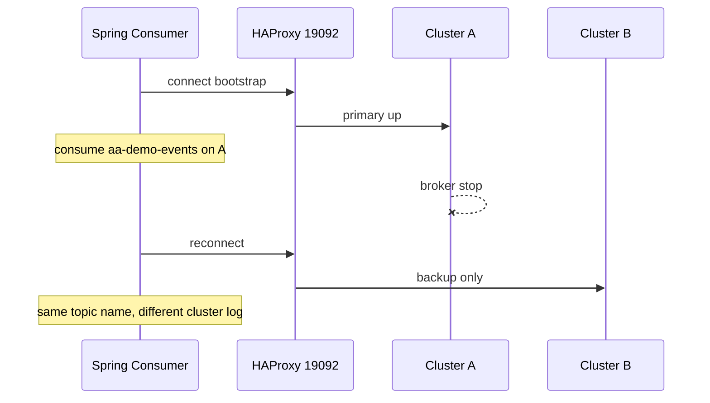

# HAProxy 기반 Consumer Failover — 설계 메모

## 1. 지금 방식의 한계 (맞는 지적)

`/api/failover/standby` 는 **Spring이 의도적으로** Primary listener 를 끄고 Standby listener 를 켭니다.

| 구분 | 앱 수동 failover | HAProxy failover |
|------|------------------|----------------|
| 트리거 | REST / Watchdog | 브로커 TCP down → check fail |
| Consumer | factory A ↔ factory B 전환 | **bootstrap 1개**, 재연결 |
| 운영 유사도 | 데모·회로 차단 검증용 | **인프라 failover** 에 가까움 |

그래서 “진짜 failover test” 를 말할 때는 **프록시 앞단에서 A 를 죽이는 시나리오**가 맞습니다.

## 2. HAProxy 로 할 수 있는 것 / 없는 것

### 할 수 있는 것 (이 프로젝트 147 구성)

- `kafka-failover-active-backup.cfg`: **A:9094 primary**, **B:9094 backup**
- A 가 죽으면 새 TCP 연결만 B 로 전달
- Spring `consumer-mode=proxy` → `bootstrap.servers=127.0.0.1:19092` 단일 consumer

### 주의 (독립 KRaft 두 대)

A 와 B 는 **서로 다른 클러스터** 입니다.

- 토픽 `aa-demo-events` 의 **로그·offset 이 다름**
- A 에만 produce 한 메시지는 B consumer 가 **보지 못함** (MM2 미러 토픽 `A.aa-demo-events` 와도 별개)
- B 로 failover 후 consumer group offset 은 **B 기준** → 유실/중복·재처리는 **offset 정책 + at-least-once** 문제

`infra/local/haproxy-kafka-tcp.cfg` 주석과 같이, **두 클러스터를 round-robin 한 포트에 섞으면** 메타데이터가 깨집니다.  
**active + backup** (한쪽만 살아 있을 때 사용) 은 그보다 낫지만, **클러스터 전환** 의미는 그대로입니다.

### advertised.listeners 이슈

브로커가 `211.x:9094` 를 광고하면, consumer 가 메타데이터 수신 후 **프록시를 우회** 할 수 있습니다.  
완전 프록시 고정은 **브로커 listener / advertised 설정** 과 맞춰야 합니다. (운영 설계 항목)

## 3. 권장 테스트 시나리오 (프록시)



1. HAProxy 기동 + Spring `--spring.profiles.active=proxy`
2. `/failover/test` → start → produce 20 ( **A 직접** produce 유지 )
3. **A 브로커 중지** (수동 failover API 사용 안 함)
4. 수 초 대기 → consume / missing / duplicate 확인
5. A 복구 → HAProxy 가 다시 A 로 (rise 후 정책에 따라)

## 4. MM2 / offset sync 와의 관계

- **MM2**: A → B 미러 토픽 `A.aa-demo-events`
- **HAProxy backup**: consumer 가 B 의 **`aa-demo-events`** 로 붙음 (미러 토픽 아님)

Active-Active “무유실 failover” 를 목표로 하면:

- 프록시 + **동일 논리 스트림**(미러 토픽 consume 또는 offset translate) + **멱등 consumer** 가 한 세트

현재 CH 테이블(`failover_message_*`) 은 **어느 경로로 consume 됐는지** 를 숫자로 남기는 용도이며, proxy 모드에서도 동일하게 쌓입니다.

## 5. 설정 요약

```yaml
# application-proxy.yaml
app:
  kafka:
    consumer-mode: proxy
    proxy-bootstrap-servers: 127.0.0.1:19092
    failover-watchdog-enabled: false
```

```bash
sudo haproxy -f infra/haproxy/kafka-failover-active-backup.cfg -D
```

## 6. dual-listener 는 언제 쓰나

- **앱 레벨** “Primary/Standby consumer 전환” 동작만 빠르게 검증
- HAProxy 없이 147 에서 API 로 시나리오 반복

프록시 failover 검증이 목적이면 **`consumer-mode=proxy` + A down** 이 정답에 가깝습니다.
