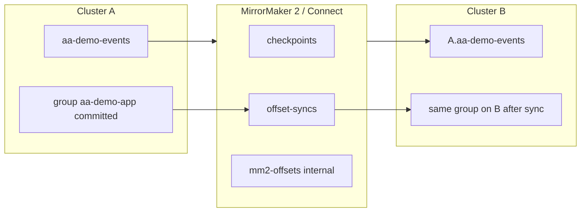

# MM2 Offset 이어받기 — Connect offset 저장소

## 한 줄

**맞습니다.** Consumer가 failover 후 미러 클러스터에서 **이어 읽으려면**, MM2(Connect)가 관리하는 **offset/checkpoint 저장소**를 통해 **소스(A)의 consumer group offset → 타깃(B) 미러 토픽 offset** 으로 **넘겨 주어야** 합니다.  
Spring 앱이 listener 만 바꾸는 것만으로는 **자동 이어받기가 되지 않습니다.**

---

## MM2 가 들고 있는 것 (개념)

| 저장소 | 토픽/위치 | 역할 |
|--------|-----------|------|
| **Connect offset storage** | `mm2-offsets.*.internal` (설정: `offset.storage.topic`) | MM2 **커넥터 태스크** 가 어디까지 복제했는지 (MirrorSource) |
| **Checkpoints** | `checkpoints.topic` (기본 `mm2-checkpoints.*.internal`) | 소스 파티션 offset ↔ **미러 파티션 offset** 매핑 |
| **Offset syncs** | `offset-syncs.topic` (기본 `mm2-offset-syncs.*.internal`) | 소스 클러스터 **consumer group** 의 committed offset 을 **타깃 클러스터·미러 토픽** 에 반영 |

레포 `infra/mm2/mm2-remote.properties` 예:

```properties
checkpoints.topic.replication.factor=1
offset-syncs.topic.replication.factor=1
offset.storage.replication.factor=1
```

---

## Consumer failover 와의 관계



1. 앱이 A 에서 `aa-demo-events` + `aa-demo-app` 으로 consume → committed on **A**.
2. MM2 **OffsetSync** (및 checkpoint) 가 주기적으로 **B 의 `A.aa-demo-events`** 에 맞는 offset 을 **B 의 `__consumer_offsets`** 에 기록.
3. Failover 후 앱이 B 에서 **같은 group id** + **미러 토픽** `A.aa-demo-events` 로 consume → **sync 된 위치**부터 읽기 시도.

**우리 앱이 해야 할 것**

- Standby/Proxy listener 토픽 = **`A.aa-demo-events`** (구현됨)
- **group id 동일** (`aa-demo-app`)
- MM2 에서 **consumer group offset sync 활성** (MM2 기본 플로우에 포함되는지 배포 설정 확인 필요)

**우리 앱이 하지 않는 것**

- Connect internal topic 을 직접 읽거나 offset 을 **수동 translate** (Connect/MM2 에 맡김)
- A/B **서로 다른 토픽명**(`aa-demo-events` vs `A.aa-demo-events`) 을 같은 group 으로 **앱만** 전환 — offset sync 없으면 B 에서 **earliest/latest** 정책에 따름

---

## At-least-once + 멱등과 함께

Offset sync 가 **완벽하지 않거나** failover 순간에 **겹치는 구간**이 있으면:

- Kafka 는 **at-least-once** 로 또 deliver 할 수 있음
- 앱 **`ProcessedMessageStore`** (JSON `id`) 로 **effectively-once** (Redis 는 나중에 영속화용)

---

## 검증 시 확인할 것

```bash
# B 에서 group offset 이 미러 토픽에 잡혔는지 (예시)
kafka-consumer-groups.sh --bootstrap-server <B> --group aa-demo-app --describe
# TOPIC 컬럼에 A.aa-demo-events 가 있고 offset 이 0이 아닌지
```

Spring 쪽 미러 **메시지 id** 검증: `failover_mirror_backlog_check` (`check_type=source_unread` / `pending_test_id`), `failover_mirror_partition_lag`.

Offset sync 가 끊기면: unread 는 미러에 있어도 consumer 는 **옛 offset** 에서 읽거나 **처음부터** 읽을 수 있음 → **멱등 필수**.

---

## 미러링 중 “뒤죽박죽” / offset 맞춰도 이상할 수 있나?

**완전히 동기화된 하나의 큐처럼 보이면 안 됩니다.** 이상·괴리가 **없는 것이 아니라**, 설계상 **창(window)** 이 항상 있습니다.

### 복제(메시지 스트림) vs offset sync(소비 위치) — 별개

| 동작 | 주기 | 하는 일 |
|------|------|---------|
| **MirrorSource** (복제) | **연속** (poll 루프) | A `aa-demo-events` → B `A.aa-demo-events` 에 **추가** |
| **Checkpoint / Offset sync** | **주기적** (초~분 단위, 설정값) | A 의 **committed offset** 을 B 미러 토픽 좌표로 **번역**해 `__consumer_offsets` 에 반영 |

→ **consumer가 commit 할 때마다** 미러와 offset 이 즉시 맞춰지는 구조가 **아닙니다.**

레포 `mm2-remote.properties` 의 `refresh.topics.interval.seconds = 10` 은 **토픽 목록 갱신** 주기이지, offset sync 주기가 아닙니다.  
(실제 checkpoint/offset sync 간격은 MM2 기본값·추가 설정 예: `emit.checkpoints.interval.seconds` 등 — 배포 설정 확인 필요)

### 순서가 “뒤죽박죽”처럼 보일 수 있는 경우

1. **파티션 내부**  
   - 보통 **순서 유지**에 가깝게 복제 (같은 key → 같은 partition 이면 produce 순서도 유지).  
   - 다만 미러는 **항상 뒤처짐(lag)** — A 에서 이미 commit 한 뒤에도 B 에는 잠시 후에 도착.

2. **파티션 간 (전역 순서)**  
   - A·B·미러 **전역 타임라인 일치 보장 없음**.  
   - `id` 로 “전역 순서”를 기대하면 어긋날 수 있음.

3. **offset sync 시점 vs 복제 시점**  
   - A committed = 1000 인데, 미러 복제는 980 까지만 왔고, offset sync 는 1000 기준으로 translate 했다면  
     → failover 후 B 에서 980~1000 구간이 **비어 있거나** 반대로 **옛 offset** 으로 읽어 **중복** 가능.  
   - 그래서 **mirror_lag**, **failover_mirror_partition_lag**, **멱등** 이 세트.

4. **failover 순간 레이스**  
   - A 에 새 메시지 produce / consume commit  
   - MM2 복제·offset sync 가 아직 한 사이클 안 돌았음  
   - HAProxy 가 B 로 넘김  
   → “offset 은 맞는데 메시지가 아직 없음” 또는 “이미 처리한데 또 옴” 둘 다 **가능** (확률 0은 아님).

### 정리 (첫 번째 질문)

- offset 을 맞춰 넘겨도 **이상·괴리 확률 0은 아님**.  
- 특히 **committed 와 mirror log end 사이 gap** + **주기적 offset sync 지연** 이 합쳐짐.  
- 대응: **at-least-once + id 멱등**, failover 전 **lag/backlog 검증**, 필요 시 **lag=0 근처까지 대기** 후 전환.

---

## “commit 되면 주기적으로 연동”인가? (두 번째 질문)

**반만 맞습니다.**

- **메시지 복제(MirrorSource):** commit 과 무관하게 **계속** 돌아감 (상시 연동).  
- **consumer offset 연동(Offset sync):** A 에서 **주기적으로** “이 group 은 소스에서 여기까지 읽었다” 를 읽어, B 미러 토픽 offset 으로 **번역·기록** — **commit 이벤트마다 즉시 X**.

그림:

```
시간 →
A 토픽:     [msg1][msg2][msg3] ...
MM2 복제:   ..........[msg1]..[msg2]...     (lag)
A commit:   --------^committed
OffsetSync: -------------------^ (다음 주기에 B __consumer_offsets 갱신)
```

그래서 운영에서는:

1. **lag 모니터링** (`mirror_lag`, partition lag)  
2. failover 전 **pending / source_unread 가 미러에 있는지** 확인  
3. 앱 **멱등** 으로 overlap 구간 흡수  

를 “정상 경로”로 두는 것이 맞습니다.
